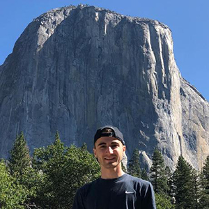

## Our Mission

*Free and open-source vaccine sentiment analysis using social media posts*

We believe that social media provides a powerful, mostly-untapped source of data on public sentiment towards vaccines. Harnessing this information holds promise for public health research, but the field is still growing and requires further contributions to generate informative conclusions. Our open-source project aims to expand the frontiers of this field and provide preliminary guidance to others working on similar problems.

To facilitate public engagement and understanding, we have both an [accessible overview](https://qtoussaint.github.io/posts/overview/) of our project that describes the data used, the basic structure of the model, and how to interpret the results (including what they can and cannot tell us), as well as an [in-depth description](https://qtoussaint.github.io/posts/methods/) geared towards researchers and other professionals in the field, which aims to make the project as transparent and accessible as possible. Feedback and questions are highly encouraged; you can find our contact details under "Contact Us" at the bottom of the page.

We maintain that scientific research is most productive and complete when it includes all persons - not just the most visible - equitably throughout planning, research, and implementation. Our project adheres to methodologies that promote transparency, open communication, diverse engagement and equitable repayment, including free and open-source code and the use of diverse, ethically-sourced public datasets. We commit to implementing inclusive and open research methods with an ultimate goal of breaking down existing barriers to scientific engagement and visibility.

## The Excellent Biological Investigators

Our team is made up of PhD students with a variety of expertise in biochemistry, statistics and software development, all with a focus on infectious disease research.

**Leonie Lorenz**  | PhD student @ University of Cambridge (UK) & European Bioinformatics Institute (EMBL-EBI) |

*Background*

My PhD focuses on jointly using epidemiological and genomic data for developing mathematical models of pathogen transmission. While the spreading and evolution of pathogens are often analysed separately, exploiting both data streams together as input for epidemiological models could increase the models’ predictive power and result in new insights.

I previously studied biomathematics at the University of Greifswald, Germany. For my master thesis, I developed a Boolean model for the regulation of apoptosis at the Max Delbrück Center for Molecular Medicine in the Helmholtz Association.

*Project role*

Data analysis and model development

**Jacqueline Toussaint** | PhD student @ University of Cambridge (UK) & European Bioinformatics Institute (EMBL-EBI) |

*Background*

I’m broadly focused on creating bioinformatic tools for performing computational, statistical and biological analysis of bacterial genomes. In particular, I’m interested in creating more efficient and accurate methods for performing genome-wide association studies (GWAS) in bacteria.

I previously studied biochemistry and microbiology at Montana State University, and am excited to further my education in the Lees Group at EMBL-EBI and the University of Cambridge.

*Project role*

Website development & design | Pipeline development

**Sam Horsefield** | PhD student @ Imperial College London |

*Background*

My PhD focuses on pangenome evolution in pathogenic bacteria. I have designed and developed ggcaller, a new annotation tool for bacterial pangenomes that works on genome graphs. Other projects include using graph methods to improve adaptive sequencing of the accessory genome, and using large population datasets to compare rates of core and accessory genome evolution.

*Project role*

Pipeline development and implementation

## Contact us

**We welcome feedback and questions! Contact any or all of us about our project via the following emails:**

Jacqueline (lilyjacqueline at ebi dot ac dot uk)

Sam (shorsfield at ebi dot ac dot uk)

Leonie (llorenz at ebi dot ac dot uk)

*For feedback on our website, contact Jacqueline at lilyjacqueline at ebi dot ac dot uk*

You can also visit our [GitHub repository](https://github.com/WellcomeIdeathon2023/Excellent_Biological_Investigators) to have your own go!
