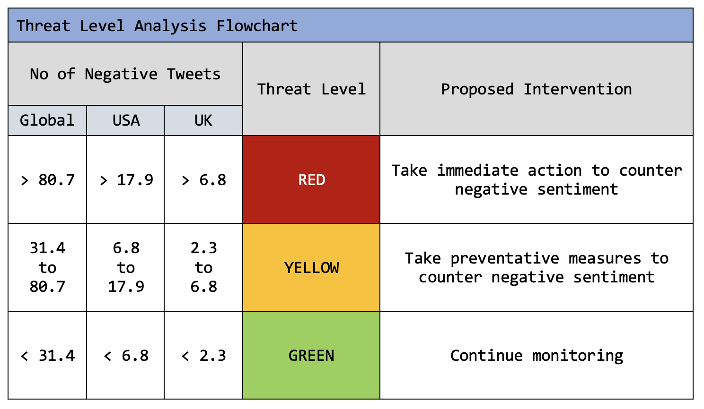

## About this resource

Are you in the right place? This description is intended for researchers and other professionals in the field. If you're interested in an accessible overview of our project that describes the data used, the basic structure of the pipeline, and how to interpret the results (including what they can and cannot tell us), please visit our helpful [public resource](https://qtoussaint.github.io/posts/overview/).

We've endeavored to make SentimentHub as transparent and accessible as possible. Feedback and questions are highly encouraged; you can find our contact details under "Contact Us" at the bottom of the page.

## Sentiment analysis pipeline

*A glossary of definitions is available at the bottom of the page.*

Sentiment analysis of Twitter data (available on [GitHub](https://github.com/WellcomeIdeathon2023/infectious_disease_challenges/blob/8146e6fad620986a7b6d54b3560ba8a1271a29dd/sentiment/datasets/vax_tweets.csv)) was performed using the pre-trained [Twitter-RoBERTa-base API for sentiment analysis](https://huggingface.co/cardiffnlp/twitter-roberta-base-sentiment-latest), an open-source natural language processing (NLP) software by HuggingFace. A score was calculated for each category of sentiment, negative (0), neutral (1), and positive (2), and the highest category was considered the overall sentiment of the tweet. 

The general workflow is displayed in the following figure:

- Takes unstructured text input.
- Transforms into a structured matrix (embedding).
- Further transforms into 1D array (convolution).
- Generates output using neural network (hidden and output layers).

Next, an R pipeline was developed to model the 30-day rolling average of total tweets with negative sentiment mentioning vaccines. Sampled were stratified by location by country, region, and city using [geograpy3](https://pypi.org/project/geograpy3/), and bootstrapping was performed to calculate 95% confidence intervals for the tweets within each time interval. The mean and standard deviation were also calculated and used to identify windows of normal, high, and very high negative sentiment on a global and country-specific scale. (Figure 1)

From this, preliminary guidelines regarding the varying levels of negative sentiment were established globally and for several locations. (Figure 2) Lastly, the amount of positive versus negative tweets over time was established and used for further mathematical modeling. (Figure 3)

## Results

**Figure 1.**  30-day rolling average of total tweets with negative sentiment mentioning “vaccines”, stratified by location, in which the green line represents the median number of negative tweets and the green box represents one standard deviation above and below this median. Red bars display 95% confidence intervals based on 100 bootstrapped samples of all tweets within each rolling average time interval.

**A)**  Global

**B)**  United States of America

**C)**  India

**D)**  United Kingdom

**Figure 2.**  Recommendations for varying levels of negative tweets based on the results of the study. These recommendations are preliminary, and further investigation is required to validate them.

**Figure 3.**  The amount of positive minus negative tweets per day (on a global scale).

## Conclusions

Sample stratification revealed that the dataset used appears heavily biased towards the United States, which follows logically given Twitter's disproportionately large American userbase. In the future, a more diverse dataset, perhaps incorporating different languages and a wider variety of regions, would increase the accuracy of the model across different populations.

Overall, our results provide a pipeline for analyzing vaccine sentiment in tweets with preliminary guidelines on how the results of that pipeline should be interpreted and the actions to be taken. Further work has to be completed in the areas of:

- relating negative sentiment to vaccine uptake in a cohesive mathematical model
- predicting incidence from sentiment data
- identifying misinformation using embedding
- real-time data mining from social media sites
- incorporating analysis capability for non-English tweets

## Glossary

Sentiment analysis - we are referring to the use of natural language processing (NLP) to identify and extract subjective information from text-based source material, such as social media posts

Uptake/vaccine uptake - the proportion of the eligible population who received a vaccine during a specific time period 

## Contact us

**We welcome feedback and questions! Contact any or all of us about our project via the following emails:**

Jacqueline (lilyjacqueline at ebi dot ac dot uk)

Sam (shorsfield at ebi dot ac dot uk)

Leonie (llorenz at ebi dot ac dot uk)

*For feedback on our website, contact Jacqueline at lilyjacqueline at ebi dot ac dot uk*

You can also visit our [GitHub repository](https://github.com/WellcomeIdeathon2023/Excellent_Biological_Investigators) to have your own go!
