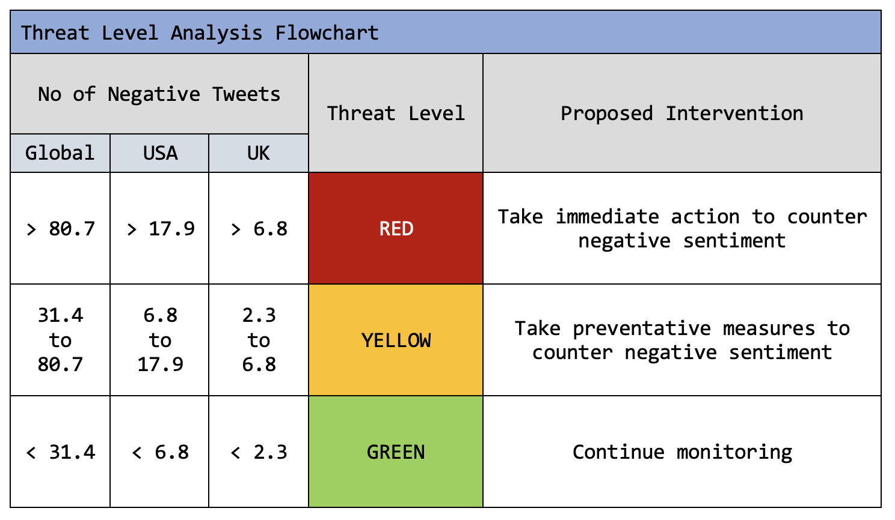

## About this resource

Are you in the right place? This page is intended for a general audience and provides an accessible description of the data used, the basic structure of the pipeline, and how to interpret the results. If you're interested in the details, see our [in-depth description](https://qtoussaint.github.io/posts/methods/) geared towards researchers and other professionals in the field. Feedback and questions are highly encouraged; you can find our contact details under "Contact Us" at the bottom of the page.

## What is sentiment analysis?

If you've ever braved social media sites like Twitter or Facebook, you'll quickly notice that a large proportion of posts are expressing an opinion on something - be it cars, politics, or celebrities. As human readers, we can quickly understand whether the opinion being expressed is positive, negative, or neutral - also known as the user's *sentiment*. Such information is useful to have; you might use the sentiment expressed in others' posts to determine whether you should open an account with a certain bank or buy a certain car.

Understanding a population's sentiment towards something is also useful for researchers and analysts. Wouldn't it be useful for social scientists to monitor levels of antisemitism over time, for a business to identify sudden decreases in satisfaction with one of their products, or for conservation biologists to understand public opinion on the introduction of new wildlife conservation regulations? Indeed, the body of research surrounding the generation and application of sentiment data, a field generally referred to as *sentiment analysis*, is rapidly growing.

## Sentiment analysis and natural language processing

Sentiment analysis would be hugely bottlenecked by the time needed for a human to read each post and manually assign a sentiment score. Luckily, recent advances in methods like natural language processing (NLP) have allowed for the computational processing of text-based data, such as social media posts, to automatically detect sentiment.

At its core, natural language processing uses linguistic principles to break apart complicated pieces of writing into their component parts, then determines how these parts fit together to fulfill some endgoal of analysis. The specifics of NLP depend on the model used; historically, NLP used grammatical rules and principles developed by linguists to categorize text, but today, machine learning (ML) approaches that make statistical connections are most often used.

Thanks to the advent of natural language processing, sentiment analysis can now be performed on large quantities of data, allowing for larger-scale analyses to be performed. 

## Exploring vaccine sentiment on social media

Our project centers around identifying vaccine sentiment using natural language processing of Twitter data. We have used a free natural language processing model trained on Twitter data to characterize the nature of a series of vaccine-related tweets contained in a [free dataset.](https://github.com/WellcomeIdeathon2023/Excellent_Biological_Investigators) 

Besides simply identifying negative sentiment, we wondered if this data could be used to predict or better understand other characteristics of the pandemic - for instance, whether it was predictive of _vaccine uptake_. Vaccine uptake refers to the proportion of the population that received a vaccine in a given time period. It's a useful metric for a variety of reasons, such as research into the sociological factors that influence vaccination in different populations, and predictions could offer practical use by informing the number of vaccines needed in different areas. However, it's not clear how (or if) social media sentiment is correlated with vaccine uptake. Thus, we embarked on a mission to elucidate some of these metrics and investigate possible correlations.

## Building a pipeline: good practices in science

All good science follows principles of reproducibility, meaning that a given experiment 1) is described well enough to be repeated under the same conditions and 2) will produce the same results (possibly with a small bit of error) when repeated. In addition, our team (the Excellent Biological Investigators) believe that science should be collaborative and accessible to other researchers.

With these considerations in mind, we have developed a _pipeline_ to analyze tweets as described above. A pipeline simply refers to a series of modules or "steps" that can be run one after the other to reach an end goal. To imagine this in more concrete terms, you could think about pipelines like a recipe. If you input the raw ingredients from your pantry into a cookie-making pipeline, it would crack the eggs, measure the wet and dry ingredients, combine and mix the ingredients, shape them into balls, cook them in the oven for a given amount of time, and output your completed cookies. It certainly makes life easier if all you have to do is input your own ingredients, rather than designing the recipe and running the steps yourself!

## Our Results

When researchers input their Twitter data into our pipeline, they'll receive a score that corresponds to the amount of negative sentiment present in the dataset, according to our model. We've developed guidelines based on the average amount of negative sentiment present at any given time. If this number increases above normal levels, it could indicate that negativity towards vaccines is rising. 

We've also performed a variety of other analyses, but these are still ongoing. Being on the frontiers of science doesn't always allow for neatly packaged conclusions, so we've saved these analyses for our [in-depth guide.](https://qtoussaint.github.io/posts/methods/)

## So you guys can tell how people feel about vaccines?

Not exactly. Firstly, our dataset is limited; not everyone uses Twitter, and many groups of people who _do_ use Twitter aren't represented in our dataset. This can render results inaccurate in real-world scenarios because we're only observing the behavior of a small fraction of the population. You can think of this like trying to imagine what a completed puzzle looks like from just one or two pieces - it would be very hard! Getting a larger and more representative dataset is a bit like having a bunch of puzzle pieces from all different parts of the puzzle - it's much easier to imagine what the whole puzzle looks like.

In addition, our pipeline needs more work to make it informative for researchers. We're working on new features to ensure that it produces consistent results and explore how results can be connected to real-world events.

## Great work! You made it through.

Have a kitten GIF for your troubles.

Ready to tackle a more complex analysis? You can read our [in-depth description](https://qtoussaint.github.io/posts/methods/), but don't feel obliged!

## Glossary

Pipeline - a series of modules or "steps" that can be run one after the other to reach an end goal

Sentiment analysis - we are referring to the use of natural language processing (NLP) to identify and extract subjective information from text-based source material, such as social media posts

Uptake/vaccine uptake - the proportion of the eligible population who received a vaccine during a specific time period 

## Contact us

**We welcome feedback and questions! Contact any or all of us about our project via the following emails:**

Jacqueline (lilyjacqueline at ebi dot ac dot uk)

Sam (shorsfield at ebi dot ac dot uk)

Leonie (llorenz at ebi dot ac dot uk)

*For feedback on our website, contact Jacqueline at lilyjacqueline at ebi dot ac dot uk*

You can also visit our [GitHub repository](https://github.com/WellcomeIdeathon2023/Excellent_Biological_Investigators) to have your own go!
