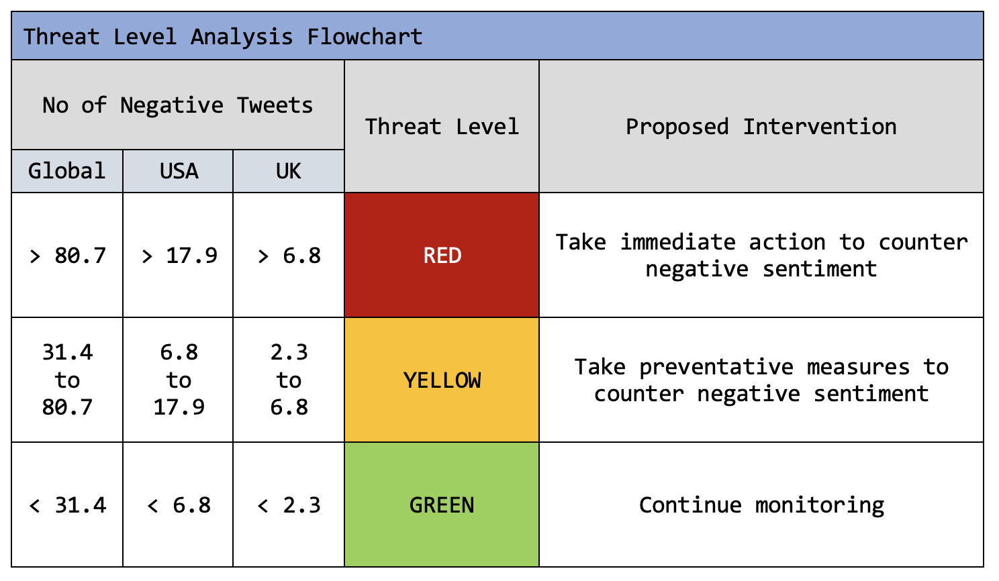

## Before you begin

This page only displays the graphical results of our sentiment analysis of tweets related to vaccines over time. Don't know what sentiment analysis is or how to interpret these graphs? Don't worry! We've written up an overview of the topic and our results that is suitable for beginners, [freely available here.](https://qtoussaint.github.io/posts/overview/) It is **critical** that you read our explanation of the analysis to avoid misinterpretating these results. We promise it will be quick!

For the data scientists and deep-divers, a more thorough explanation of the model is available [here](https://qtoussaint.github.io/posts/methods/),
and the code is freely available on [our GitHub](https://github.com/WellcomeIdeathon2023/Excellent_Biological_Investigators).

## Threat Level Guidelines

Remember, models are just models, and they must be interpreted in light of their limitations and weaknesses. Visit our [model overview](https://qtoussaint/qtoussaint.github.io/overview)
or [thorough explanation](https://qtoussaint/qtoussaint.github.io/methods) to ensure you understanding how these results were generated, and check out
[the code](https://github.com/WellcomeIdeathon2023/Excellent_Biological_Investigators) to test it yourself.

## Contact us

**We welcome feedback and questions! Contact any or all of us about our project via the following emails:**

Jacqueline (lilyjacqueline at ebi dot ac dot uk)

Sam (shorsfield at ebi dot ac dot uk)

Leonie (llorenz at ebi dot ac dot uk)

*For feedback on our website, contact Jacqueline at lilyjacqueline at ebi dot ac dot uk*

You can also visit our [GitHub repository](https://github.com/WellcomeIdeathon2023/Excellent_Biological_Investigators) to have your own go!
